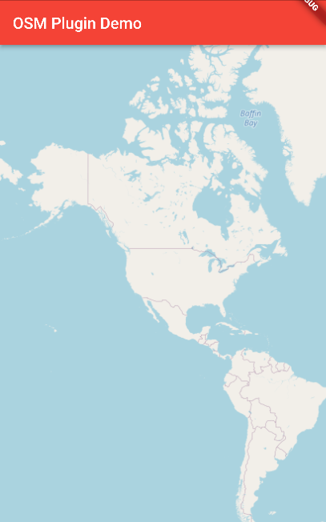
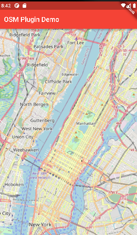
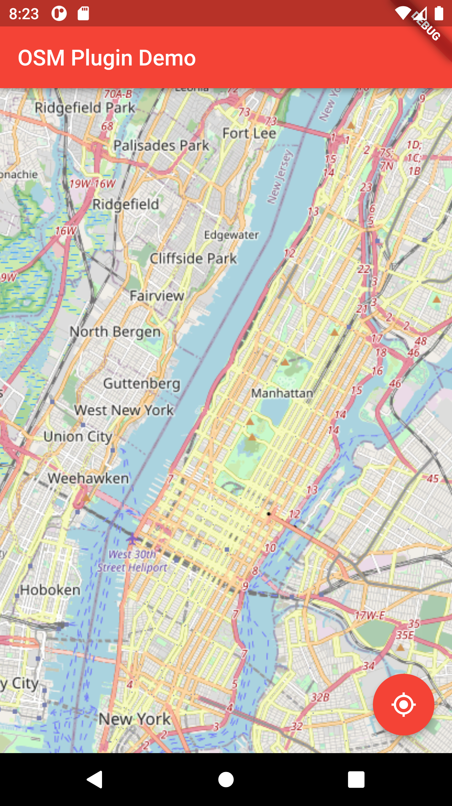

# OSM Plugin Tutorial

Let's start with a single page app, that shows the map full screen. And let's start with the minimum amount of code to make that happen. We start with two files, `main.dart` containing the minimal flutter setup and the actual widget in `map_widget.dart`.

## Configuration

But first add the following dependency. The flutter dependency is in the code block for reference only, so you can see the right indentation.

### Dependency

`pubspec.yaml` 

```yaml
dependencies:
  flutter:
    sdk: flutter
  flutter_osm_plugin: ^0.37.2
```

### Android SDK version

The OSM Plugin forces the Android SDK to be on level 33. There are two changes needed in `android/app/build.gradle`. Watch out, there is also `android/build.gradle`, that is the wrong one. Make the following changes:

```
android {
    compileSdkVersion 33
```

```
android {
	defaultConfig {
   		minSdkVersion 19
```

### MultiDex

When you run into a multidex issue add the following multidex entry

```
android {
    defaultConfig {
    	multiDexEnabled true
```

## Minimal App

`main.dart`

```dart
import 'package:flutter/material.dart';
import 'map_widget.dart';

void main() => runApp(App());

class App extends StatelessWidget {
  const App({Key? key}) : super(key: key);

  @override
  Widget build(BuildContext context) {
    return MaterialApp(
      title: 'OSM Plugin Demo',
      theme: ThemeData(primarySwatch: Colors.red),
      home: HomePage(),
    );
  }
}

class HomePage extends StatelessWidget {
  const HomePage({Key? key}) : super(key: key);

  @override
  Widget build(BuildContext context) {
    return Scaffold(
      appBar: AppBar(
        title: Text("OSM Plugin Demo"),
      ),
      body: OsmWidget(),
    );
  }
}
```

`map_widget.dart`

```dart
import 'package:flutter/material.dart';
import 'package:flutter_osm_plugin/flutter_osm_plugin.dart';

class OsmWidget extends StatefulWidget {
  @override
  State<StatefulWidget> createState() => OsmWidgetState();
}

class OsmWidgetState extends State<OsmWidget> {
  MapController controller = MapController();

  @override
  Widget build(BuildContext context) {
    return OSMFlutter(
      controller: controller,
    );
  }
}
```

This will give you a map of a big chunk of the planet. The center location is in this case Google, San Jose:



## Zoomlevel

You can zoom in on this map to a specified zoom levels. In OSM zoom levels are defined between 0 and 20, inclusive. https://wiki.openstreetmap.org/wiki/Zoom_levels In the OSM plugin you are restricted from 2 to 19 inclusive. You can give an initial zoom level while creating the `OSMFlutter` Widget

```dart
Widget build(BuildContext context) {
  return OSMFlutter(
    controller: controller,
    initZoom: 16,
  );
}
```


Using the map in an emulator will make it hard to experiment with out of the box zoom capabilities supplied by OSM Plugin. Running it on a physical device makes that a lot easier. When running on a physical device you can zoom in and out with two fingers. And move the center of the map to another location by dragging. 

Min and max zoom is restricted by `minZoomLevel` and `maxZoomLevel`. It is no longer possible to zoom in or out further then the supplied values.

```dart
OSMFlutter(
  controller: controller,
  initZoom: 16,
  minZoomLevel: 2,
  maxZoomLevel: 19,
);
```

## Initial location

You can set the initial position on the controller. Either you choose to pick a location with a `GeoPoint` or you go for your current location. Suppose we want to open the map over Central Park, New York. Select the location in Google Maps and look at the address bar of your browser:

https://www.google.com/maps/place/Central+Park/@40.7831095,-73.9773441,14.14z/data=!4m5!3m4!1s0x89c2589a018531e3:0xb9df1f7387a94119!8m2!3d40.7812199!4d-73.9665138

The first number after the @ is the latitude and the second number is the longitude. you can use these numbers as follows while creating the controller. The default value for `initMapWithUserPosition` is true and overrules the `initPosition` Therefore if you do not specify it you will end up at your current position when testing on your phone. The emulator doesn't have a current position and behaves slightly different.

```dart
MapController controller = MapController(
    initMapWithUserPosition: false,
    initPosition: GeoPoint(latitude: 40.7831095, longitude: -73.9773441)
)
```

With zoom level 12 you will get this




## Move to current location

It is possible to move to the current location with the help of a button. To have the current location button placed in the right corner you can use the `Scaffold` widget with a`floatingActionButton`. In the `onPressed` you write `() async { Await controller.currentLocation(); }`


```dart
class _OsmWidgetState extends State<OsmWidget> {
  MapController controller = MapController(
      initMapWithUserPosition: false,
      initPosition: GeoPoint(latitude: 40.7831095, longitude: -73.9773441));

  @override
  Widget build(BuildContext context) {
    return Scaffold(
      body: OsmMap(controller: controller),
      floatingActionButton: CurrentLocationButton(controller: controller),
    );
  }
}

class CurrentLocationButton extends StatelessWidget {
  const CurrentLocationButton({
    Key? key,
    required this.controller,
  }) : super(key: key);

  final MapController controller;

  @override
  Widget build(BuildContext context) {
    return FloatingActionButton(
      onPressed: () async {
        await controller.currentLocation();
      },
      child: Icon(Icons.my_location),
    );
  }
}

class OsmMap extends StatelessWidget {
  const OsmMap({
    Key? key,
    required this.controller,
  }) : super(key: key);

  final MapController controller;

  @override
  Widget build(BuildContext context) {
    return OSMFlutter(
      controller: controller,
      initZoom: 12,
      minZoomLevel: 2,
      maxZoomLevel: 19,
    );
  }
}
```




## Zoom

Zoom is controlled with 4 initial values. These values influence the way the zoom functions on the controller are working. The zoom values are doubles. Level suggest an int 

```dart
OSMFlutter(
  controller: controller,
  initZoom: 12,
  minZoomLevel: 2,
  maxZoomLevel: 19,
  stepZoom: 2,
);
```

There are several ways to adjust the zoom level

```dart
await controller.zoomIn();
await controller.zoomOut();
await controller.setZoom(stepZoom: 7);
await controller.setZoom(zoomLevel: 19);
```

zoomIn() and zoomOut() use the current stepzoom for the delta. If stepZoom is negative, zoomIn() effectively becomes a zoomout.

setZoom(stepZoom: 7) zooms in or out with the given step

setZoom(zoomLevel: 19) zooms to the given level (not working)

## Questions

Why is there a restriction on zoom level at low end and why is there a restriction on the zoom level on the high end?


